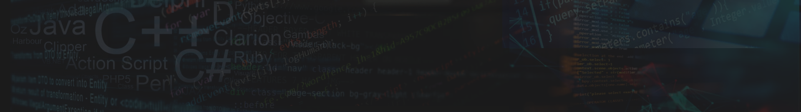

# Hi there 👋, I'm İsmail Emre

I'm a software developer from Turkey. So far, I have developed many different projects and worked in different fields such as web development, desktop app development, artificial intelligence and more.

- 🔭 I’m currently working on a **computer vision project**

- 🌱 I’m currently learning **Tensorflow, Keras**

- 💬 Ask me about **Python, Qt**

- 👨‍💻 I also plan to learn about **mobile development**

**Skills:**

 

